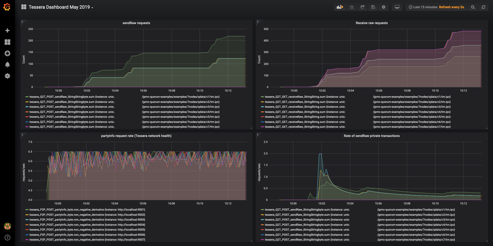
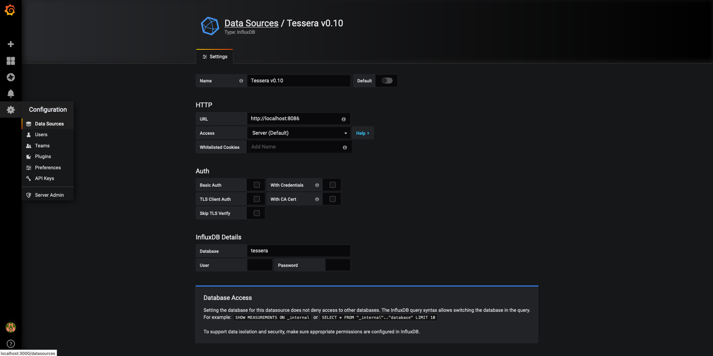
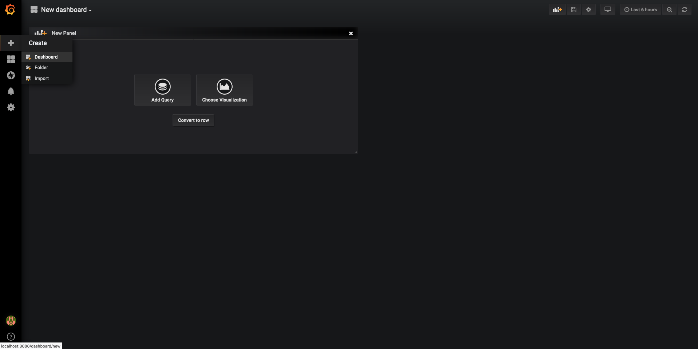
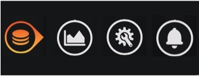
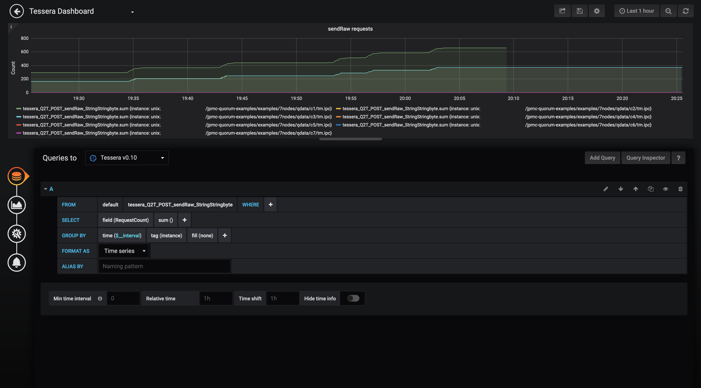
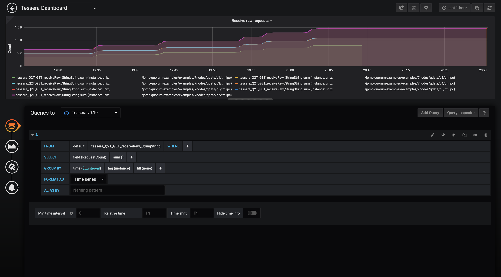
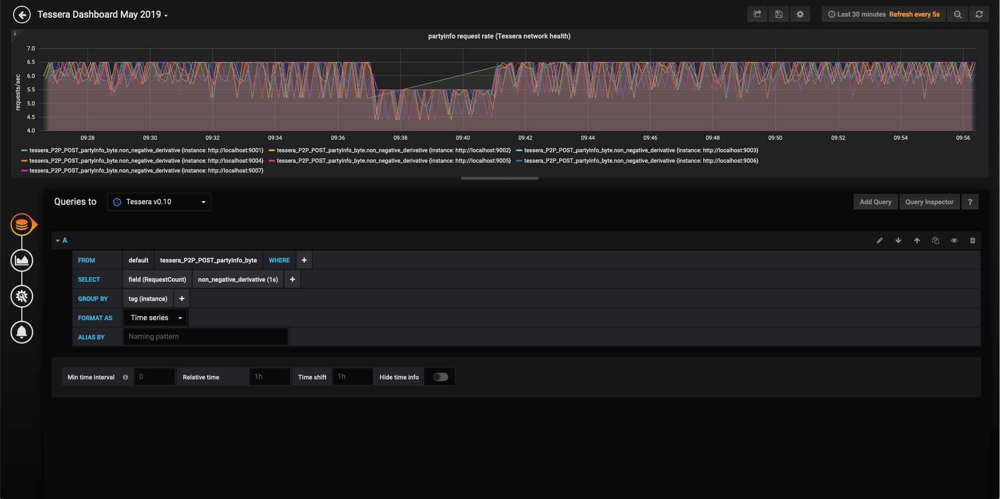
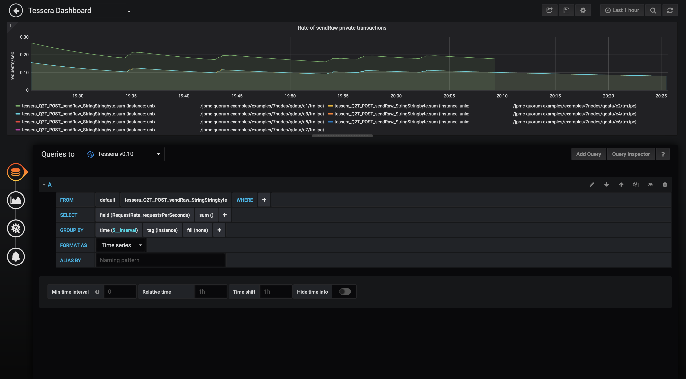

# Monitor Tessera

Tessera can be used with InfluxDB and Prometheus time-series databases to record API usage metrics.  The data recorded can be visualised either by creating a custom dashboard or by using an existing dashboarding tool such as Grafana.

In addition, Tessera logs can be searched, analyzed and monitored using Splunk.  Splunk can be set up in such a way that the logs for multiple Tessera nodes in a network are accessible from a single centralized Splunk instance.

## API Metrics
Tessera can record the following usage metrics for each endpoint of its API:

* Average Response Time
* Max Response Time
* Min Response Time
* Request Count
* Requests Per Second

These metrics can be stored in an InfluxDB or Prometheus time-series database for further analysis.

* [InfluxDB](https://www.influxdata.com/time-series-platform/influxdb/) should be used when it is preferred for metrics to be "pushed" from Tessera to the DB (i.e. Tessera starts a service which periodically writes the latest metrics to the DB by calling the DBs API)
* [Prometheus](https://prometheus.io/) should be used when it is preferred for metrics to be "pulled" from Tessera by the DB (i.e. Tessera exposes a `/metrics` API endpoint which the DB periodically calls to fetch the latest metrics)

Both databases integrate well with the open source dashboard editor [Grafana](https://grafana.com/) to allow for easy creation of dashboards to visualise the data being captured from Tessera.

### Using InfluxDB
See the [InfluxDB documentation](https://docs.influxdata.com/influxdb) for details on how to set up an InfluxDB database ready for use with Tessera.  A summary of the steps is as follows:

1. [Install InfluxDB](https://docs.influxdata.com/influxdb/v1.7/introduction/installation/)
1. Start the InfluxDB server
    ```bash
    influxd -config /path/to/influx.conf
    ```
    For local development/testing the default configuration file (Linux: `/etc/influxdb/influxdb.conf`, macOS: `/usr/local/etc/influxdb.conf`), should be sufficient.  For further configuration options see [Configuring InfluxDB](https://docs.influxdata.com/influxdb/v1.7/administration/config/) 
1. Connect to the InfluxDB server using the [`influx` CLI](https://docs.influxdata.com/influxdb/v1.7/tools/shell/) and create a new DB.  If using the default config, this is simply:
    ```bash
    influx
    > CREATE DATABASE myDb
    ```
1. To view data stored in the database use the [Influx Query Language](https://docs.influxdata.com/influxdb/v1.7/query_language/)
    ```bash
    influx
    > USE myDb
    > SHOW MEASUREMENTS
    > SELECT * FROM <measurement>
    ```
    
!!! info
    The InfluxDB HTTP API can be called directly as an alternative to using the `influx` CLI

Each Tessera server type (i.e. `P2P`, `Q2T`, `ADMIN`, `THIRDPARTY`, `ENCLAVE`) can be configured to store API metrics in an InfluxDB.  These servers can be configured to store metrics to the same DB or separate ones.  Not all servers need to be configured to store metrics.

To configure a server to use an InfluxDB, add `influxConfig` to the server config.  For example:

```json
"serverConfigs": [
    {
        "app":"Q2T",
        "enabled": true,
        "serverAddress":"unix:/path/to/tm.ipc",
        "communicationType" : "REST",
        "influxConfig": {
            "serverAddress": "https://localhost:8086",  // InfluxDB server address
            "dbName": "myDb",                           // InfluxDB DB name (DB must already exist)
            "pushIntervalInSecs": 15,                   // How frequently Tessera will push new metrics to the DB
            "sslConfig": {                              // Config required if InfluxDB server is using TLS
                "tls": "STRICT",
                "sslConfigType": "CLIENT_ONLY",
                "clientTrustMode": "CA",
                "clientTrustStore": "/path/to/truststore.jks",
                "clientTrustStorePassword": "password",
                "clientKeyStore": "path/to/truststore.jks",
                "clientKeyStorePassword": "password"
            }
        }
    },
    {
        "app":"P2P",
        "enabled": true,
        "serverAddress":"http://localhost:9001",
        "communicationType" : "REST",
        "influxConfig": {
            "serverAddress": "http://localhost:8087",
            "dbName": "anotherDb",
            "pushIntervalInSecs": 15
        }
    }
]
```

#### InfluxDB TLS Configuration
InfluxDB supports 1-way TLS.  This allows clients to validate the identity of the InfluxDB server and provides data encryption.  

See [Enabling HTTPS with InfluxDB](https://docs.influxdata.com/influxdb/v1.7/administration/https_setup/) for details on how to secure an InfluxDB server with TLS.  A summary of the steps is as follows:

1. Obtain a CA/self-signed certificate and key (either as separate `.crt` and `.key` files or as a combined `.pem` file)
1. Enable HTTPS in `influx.conf`:
    ``` bash
    # Determines whether HTTPS is enabled.
    https-enabled = true
 
    # The SSL certificate to use when HTTPS is enabled.
    https-certificate = "/path/to/certAndKey.pem"
    
    # Use a separate private key location.
    https-private-key = "/path/to/certAndKey.pem"
    ```
1. Restart the InfluxDB server to apply the config changes

To allow Tessera to communicate with a TLS-secured InfluxDB, `sslConfig` must be provided.  To configure Tessera as the client in 1-way TLS:
```json
"sslConfig": {
    "tls": "STRICT",
    "sslConfigType": "CLIENT_ONLY",
    "clientTrustMode": "CA",
    "clientTrustStore": "/path/to/truststore.jks",
    "clientTrustStorePassword": "password",
    "clientKeyStore": "path/to/truststore.jks",
    "clientKeyStorePassword": "password",
    "environmentVariablePrefix": "INFLUX"
}
```
where `truststore.jks` is a Java KeyStore format file containing the trusted certificates for the Tessera client (e.g. the certificate of the CA used to create the InfluxDB certificate).  

If securing the keystore with a password this password should be provided.  Passwords can be provided either in the config (e.g. `clientTrustStorePassword`) or as environment variables (using `environmentVariablePrefix` and setting `<PREFIX>_TESSERA_CLIENT_TRUSTSTORE_PWD`).  The [TLS Config](../Configure/TLS.md) documentation explains this in more detail.

As Tessera expects 2-way TLS, a `.jks` file for the `clientKeyStore` must also be provided.  This will not be used so can simply be set as the truststore.

### Using Prometheus
The [Prometheus documentation](https://prometheus.io/docs/introduction/overview/) provides all the information needed to get Prometheus setup and ready to integrate with Tessera.  The [Prometheus First Steps](https://prometheus.io/docs/introduction/first_steps/) is a good starting point.  A summary of the steps to store Tessera metrics in a Prometheus DB are as follows:

1. Install Prometheus
1. Create a `prometheus.yml` configuration file to provide Prometheus with the necessary information to pull metrics from Tessera.  A simple Prometheus config for use with the [7nodes example network](../../../../Getting Started/Quorum-Examples) is:
    ```yaml
    global:
      scrape_interval:     15s
      evaluation_interval: 15s 
    
    scrape_configs:
      - job_name: tessera-7nodes
        static_configs:
          - targets: ['localhost:9001', 'localhost:9002', 'localhost:9003', 'localhost:9004', 'localhost:9005', 'localhost:9006', 'localhost:9007']
    ```
1. Start Tessera.  As Tessera always exposes the `metrics` endpoint no additional configuration of Tessera is required
1. Start Prometheus
    ```bash
    prometheus --config.file=prometheus.yml
    ```
1. To view data stored in the database, access the Prometheus UI (by default `localhost:9090`, this address can be changed in `prometheus.yml`) and use the [Prometheus Query Language](https://prometheus.io/docs/prometheus/latest/querying/basics/)

### Creating a Grafana dashboard
Grafana can be used to create dashboards from data stored in InfluxDB or Prometheus databases.  See the [Grafana documentation](http://docs.grafana.org/) and [Grafana Getting Started](https://grafana.com/docs/guides/getting_started/) for details on how to set up a Grafana instance and integrate it with databases.  A summary of the steps is as follows:

1. [Install and start Grafana](https://grafana.com/docs/) as described for your OS (if using the default config, Grafana will start on port `3000` and require login/password `admin/admin` to access the dashboard)
1. Create a Data Source to provide the necessary details to connect to the database 
1. Create a new Dashboard
1. Add panels to the dashboard.  Panels are the graphs, tables, statistics etc. that make up a dashboard. The New Panel wizard allows the components of the panel to be configured:
    * Queries: Details the query to use retrieve data from the datasource, see the following links for info on using the Query Editor for [InfluxDB](https://grafana.com/docs/features/datasources/influxdb/) and [Prometheus](https://grafana.com/docs/features/datasources/prometheus/)
    * Visualization: How to present the data queried, including panel type, axis headings etc.
    
#### Example dashboard
[](../../images/tessera/monitoring/example-grafana-dashboard.png)

To create this dashboard, a [7nodes example network](../../../../Getting Started/Quorum-Examples) was started, with each Tessera node configured to store its `P2P` and `Q2T` metrics to the same InfluxDB.  Several runs of the Quorum Acceptance Tests were run against this network to simulate network activity.  

As can be seen in the top-right corner, the dashboard was set to only show data collected in the past 15 mins.  

To create a dashboard similar to this:

1. Create an InfluxDB datasource within Grafana:
    1. Hover over the cog icon in the left sidebar
    1. Data Sources
    1. Add data source
    1. Select the type of DB to connect to (e.g. InfluxDB or Prometheus)
    1. Fill out the form to provide all necessary DB connection information, e.g.: 
    [](../../images/tessera/monitoring/grafana-influxdb-datasource.png)

1. Create a new dashboard
    1. Hover over the plus icon in the left sidebar
    1. Dashboard
    1. Add Query to configure the first panel
    1. Add Panel in the top-right to add additional panels
    [](../../images/tessera/monitoring/grafana-new-dashboard.png)

    !!! note
        For each of the following examples, additional options such as titles, axis labels and formatting can be configured by navigating the menus in the left-hand sidebar
    
        [](../../images/tessera/monitoring/grafana-panel-sidebar.png)

1. Create *sendRaw requests* panel
    1. Select the correct datasource from the *Queries to* dropdown list
    1. Construct the query as shown in the below image.  This retrieves the data for the `sendraw` API from the InfluxDB, finds the sum of the `RequestCount` for this data (i.e. the total number of requests) and groups by `instance` (i.e. each Tessera node).  `time($_interval)` automatically scales the graph resolution for the time range and graph width.
    [](../../images/tessera/monitoring/grafana-send-raw-query.png)

    This panel shows the number of private payloads sent to Tessera using the `sendraw` API over time.

1. Create *receiveRaw requests* panel
    1. Select the correct datasource from the *Queries to* dropdown list
    1. Construct the query as shown in the below image.  This retrieves the data for the `receiveraw` API from the InfluxDB, finds the sum of the `RequestCount` for this data (i.e. the total number of requests) and groups by `instance` (i.e. each Tessera node).  `time($_interval)` automatically scales the graph resolution for the time range and graph width.
    [](../../images/tessera/monitoring/grafana-receive-raw-query.png)

    This panel shows the number of private payloads retrieved from Tessera using the `receiveraw` API over time.

1. Create *partyinfo request rate (Tessera network health)* panel
    1. Select the correct datasource from the *Queries to* dropdown list
    1. Construct the query as shown in the below image.  This retrieves the data for the `partyinfo` API from the InfluxDB, finds the non-negative derivative of the `RequestCount` for this data and groups by `instance` (i.e. each Tessera node).  `non_negative_derivative(1s)` calculates the per second change in `RequestCount` and ignores negative values that will occur if a node is stopped and restarted.
    [](../../images/tessera/monitoring/grafana-partyinfo-rate.png)

    This panel shows the rate of POST requests per second to `partyinfo`. For this network of 7 healthy nodes, this rate fluctuates between 5.5 and 6.5 requests/sec.  At approx 09:37 node 1 was killed and the partyinfo rate across all nodes immediately drops.  This is because they are no longer receiving requests to their `partyinfo` API from node 1.  At 09:41 node 1 is restarted and the rates return to their original values.  
    
    This metric can be used as an indirect method of monitoring the health of the network.  Using some of the more advanced InfluxDB query options available in Grafana and the other metrics measurements available it may be possible to make this result more explicit. 

    [Alerts and rules](https://grafana.com/docs/alerting/notifications/) can be configured to determine when a node has disconnected and send notifications to pre-configured channels (e.g. Slack, email, etc.).   

1. Create *sendRaw rate* panel
    1. Select the correct datasource from the *Queries to* dropdown list
    1. Construct the query as shown in the below image.  This retrieves the data for the `sendraw` API from the InfluxDB, finds the sum of the `RequestRate` for this data and groups by `instance` (i.e. each Tessera node).  `time($_interval)` automatically scales the graph resolution for the time range and graph width.
    [](../../images/tessera/monitoring/grafana-sendraw-rate-query.png)

    The POST `sendraw` API is used by Quorum whenever a private transaction is sent using the `eth_sendTransaction` or `personal_sendTransaction` API.  This panel gives a good indication of the private tx throughput in Quorum.  Note that if the `sendraw` API is called by another process, the count will not be a true representation of Quorum traffic.

## Monitoring a Tessera network with Splunk
Splunk can be used to search, analyze and monitor the logs of Tessera nodes.  

To consolidate the logs from multiple Tessera nodes in a network requires setting up Splunk and Splunk Universal Forwarders.  The following pages from the Splunk documentation are a good starting point for understanding how to achieve this:

* [Consolidate data from multiple hosts](http://docs.splunk.com/Documentation/Forwarder/7.1.2/Forwarder/Consolidatedatafrommultiplehosts)
* [Set up the Universal Forwarder](http://docs.splunk.com/Documentation/Splunk/7.1.2/Forwarding/EnableforwardingonaSplunkEnterpriseinstance#Set_up_the_universal_forwarder)
* [Configure the Universal Forwarder](http://docs.splunk.com/Documentation/Forwarder/7.1.2/Forwarder/Configuretheuniversalforwarder)
*  [Enable a receiver](http://docs.splunk.com/Documentation/Forwarder/7.1.2/Forwarder/Enableareceiver)

The general steps to consolidate the logs for a Tessera network in Splunk are:

1. Set up a central Splunk instance if one does not already exist.  Typically this will be on a separate host to the hosts running the Tessera nodes.  This is known as the *Receiver*.
1. Configure the Tessera hosts to forward their node's logs to the *Receiver* by:
    1. Configuring the format and output location of the node's logs.  This is achieved by configuring logback (the logging framework used by Tessera) at node start-up.  
    
        The following example XML configures logback to save Tessera's logs to a file.  See the [Logback documentation](https://logback.qos.ch/manual/configuration.html#syntax) for more information on configuring logback:
        ``` xml
        <?xml version="1.0" encoding="UTF-8"?>
           <configuration>            
               <appender name="FILE" class="ch.qos.logback.core.FileAppender">
                   <file>/path/to/file.log</file>
                   <encoder>
                       <pattern>%d{HH:mm:ss.SSS} [%thread] %-5level %logger{36} - %msg%n</pattern>
                   </encoder>
               </appender>    
               
               <logger name="org.glassfish.jersey.internal.inject.Providers" level="ERROR" />
               <logger name="org.hibernate.validator.internal.util.Version" level="ERROR" />
               <logger name="org.hibernate.validator.internal.engine.ConfigurationImpl" level="ERROR" />
        
               <root level="INFO">
                   <appender-ref ref="FILE"/>
               </root>
           </configuration>
        ```
    
        To start Tessera with an XML configuration file:
         
        ``` bash
        java -Dlogback.configurationFile=/path/to/logback-config.xml -jar /path/to/tessera-app-<version>-app.jar -configfile /path/to/config.json
        ```
        
    1. Set up Splunk *Universal Forwarders* (lightweight Splunk clients) on each Tessera host to forward log data for their node to the *Receiver*
    1. Set up the Splunk *Receiver* to listen and receive logging data from the *Universal Forwarders*


